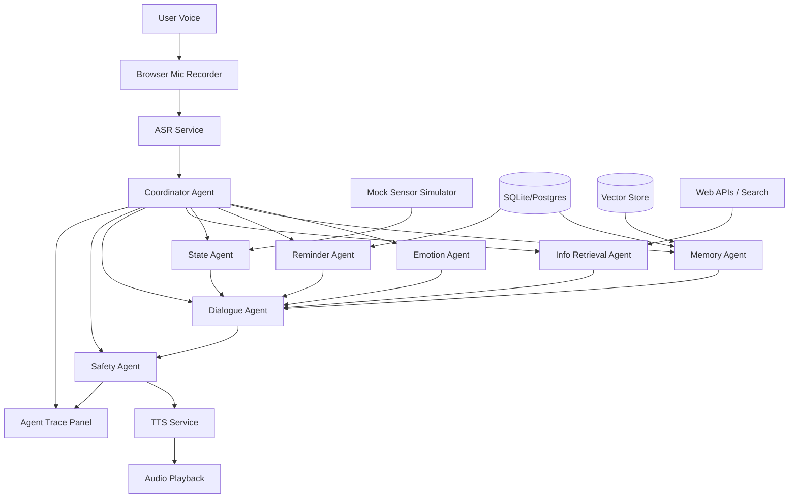
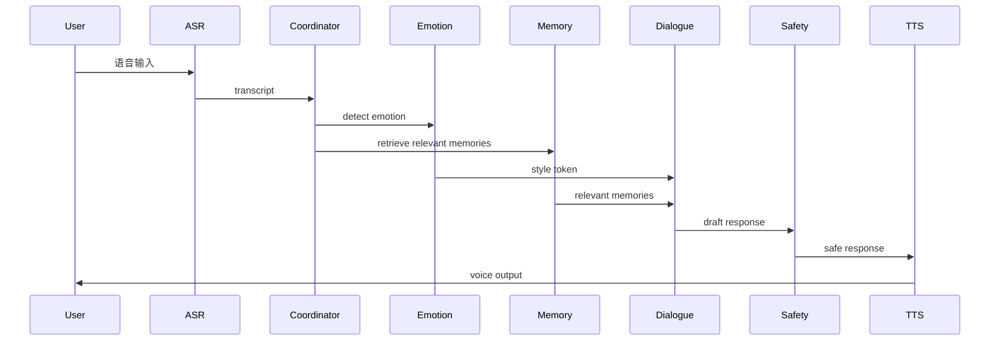
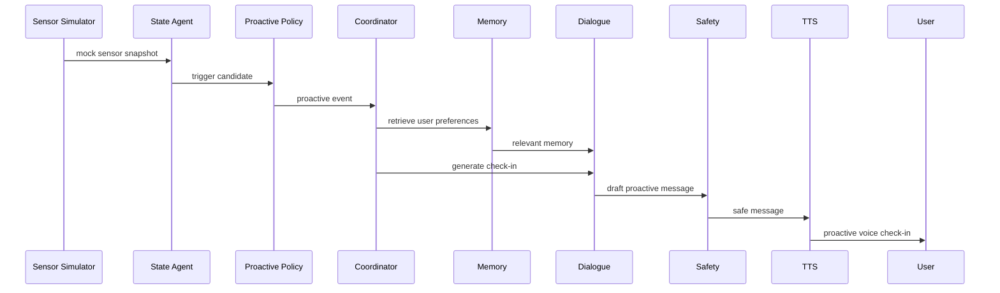
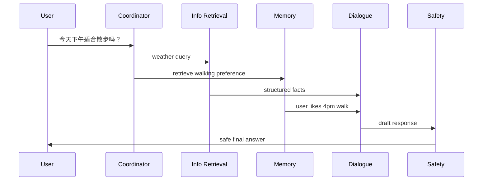
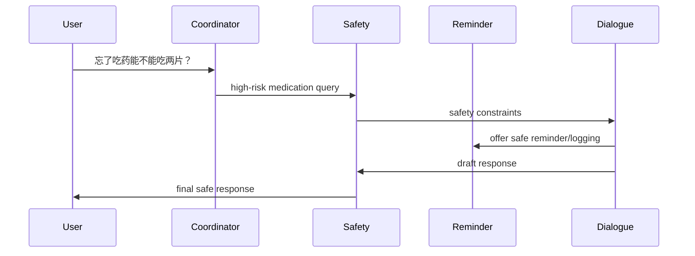

# 技术路线文档：老年人多智能体陪伴 AI

版本：v0.1  
日期：2026-06-12  
项目：A Multi-Agent Collaborative Companion Robot for Older Adults  
阶段：课程级 Demo / Research Prototype  

---

## 1. 技术目标

构建一个网页端 Demo，支持：

```text
语音输入
→ ASR
→ 多智能体编排
→ 情绪判断
→ 记忆检索/更新
→ 提醒管理
→ mock sensor 主动触发
→ 受控联网查询
→ 安全审查
→ TTS 语音输出
→ agent trace 可视化
```

核心工程目标不是训练新模型，而是完成一个稳定、可解释、可演示的 HCI 原型。

---

## 2. 总体架构

### 2.1 推荐架构

采用**中央协调器 + 专职 agent** 的架构。

不建议使用完全去中心化 agent swarm，因为老年陪伴场景更重视：

- 安全边界；
- 语气一致；
- 主动关怀频率控制；
- 记忆可控；
- 过程可解释；
- demo 可展示。

### 2.2 架构图



### 2.3 核心技术决策

| 模块 | 推荐方案 | 原因 |
|---|---|---|
| 前端 | React / Next.js | 快速搭 UI，适合网页 demo |
| 后端 | Python FastAPI | 易于接入 LLM、数据库、调度任务 |
| Agent 编排 | LangGraph | 适合状态机、路由、checkpoint、agent trace |
| ASR | API 优先 | 降低语音识别工程复杂度 |
| TTS | API 优先 | 声音自然，demo 效果好 |
| LLM | API 优先 | 周期短，稳定性优先 |
| 数据库 | SQLite 起步，Postgres 可选 | MVP 简单可靠 |
| 向量库 | Chroma / FAISS | episodic memory 检索 |
| 定时任务 | APScheduler / 后端 event loop | 提醒和主动关怀 |
| 部署 | 本地运行 + 可选云端 | 课程 demo 足够 |

---

## 3. Agent 设计

### 3.1 Coordinator Agent

#### 职责

- 接收 ASR 文本和上下文；
- 判断用户意图；
- 判断是否有健康/安全风险；
- 判断是否需要联网；
- 决定调用哪些 agent；
- 组合 agent 输出；
- 生成 trace；
- 保证最终回复经过 Safety Agent。

#### 输入

```json
{
  "user_id": "u001",
  "user_text": "今天下午适合出去散步吗？",
  "conversation_context": [],
  "current_time": "2026-06-12T14:00:00",
  "active_sensor_state": {},
  "active_reminders": []
}
```

#### 输出

```json
{
  "intent": "time_sensitive_query",
  "emotion": "neutral",
  "risk_level": "low",
  "agents_to_call": ["memory", "info_retrieval", "dialogue", "safety"],
  "web_needed": true,
  "reason": "User asks whether it is suitable to walk this afternoon, requiring current weather."
}
```

#### 路由规则

```text
情绪倾诉 → Emotion + Memory + Dialogue + Safety
提醒设置 → Reminder + Memory + Dialogue + Safety
主动关怀 → State + Memory + Dialogue + Safety
时效查询 → Info Retrieval + Memory + Dialogue + Safety
健康风险 → Safety first + optional safe retrieval + Dialogue rewrite
记忆管理 → Memory + Dialogue + Safety
```

---

### 3.2 Emotion Agent

#### 职责

- 识别用户情绪；
- 给 Dialogue Agent 提供 style token；
- 不是临床情绪诊断，只是交互风格判断。

#### 情绪标签

```text
neutral
sad
lonely
anxious
angry
happy
confused
repetitive
health_risk
crisis
```

#### 输出示例

```json
{
  "emotion": "lonely",
  "confidence": 0.78,
  "style_token": "warm_slow_validating",
  "response_guidance": {
    "length": "short",
    "pace": "slow",
    "must_do": ["validate emotion", "offer companionship"],
    "avoid": ["lecturing", "quick topic change", "overly cheerful tone"],
    "follow_up_questions": 1
  }
}
```

---

### 3.3 Dialogue Agent

#### 职责

- 生成最终自然语言回复草稿；
- 维护稳定 persona；
- 承接情绪；
- 延续对话；
- 整合 memory、reminder、sensor、web retrieval 结果；
- 输出给 Safety Agent 做最终审查。

#### Persona Prompt 要点

```text
你是“小禾”，一个面向老年人的语音陪伴 AI。
你的语气温和、耐心、简洁、尊重。
你优先让用户感到被听见、被记住、被尊重。
你不是医生，不提供诊断、用药剂量或治疗方案。
用户表达情绪时，先回应感受，再处理事实。
每次最多问一个主要问题。
不要使用网络梗、讽刺、毒舌、过度卖萌或年轻化表达。
```

#### 回复结构建议

```text
1. 情绪承接
2. 内容回应
3. 记忆/事实/提醒整合
4. 安全边界，如需要
5. 一个轻量 follow-up
```

---

### 3.4 Memory Agent

#### 职责

- 保存长期用户画像；
- 保存事件记忆；
- 检索与当前对话相关的记忆；
- 支持用户查看、修改、删除、暂停记忆；
- 避免保存敏感或高风险内容，除非用户明确授权且用于提醒。

#### 记忆分层

```text
短期记忆：当前会话上下文，放在 LangGraph state / checkpoint
长期结构化记忆：用户画像、偏好、习惯、人物关系，放 SQL DB
长期情节记忆：重要对话摘要，放 vector store
提醒记忆：提醒任务，放 SQL DB
安全事件：只保存最小必要摘要，放 SQL DB
```

#### 数据模型：UserProfile

```json
{
  "user_id": "u001",
  "display_name": "王阿姨",
  "preferred_language": "zh-CN",
  "preferred_tts_speed": "slow",
  "likes": ["粤剧", "下午散步"],
  "dislikes": ["太频繁提醒"],
  "family": [
    {
      "name": "小敏",
      "relation": "孙女",
      "permission_to_mention": true
    }
  ],
  "routine": {
    "wake_up": "07:30",
    "walk_time": "16:00",
    "medication_time": "08:00"
  },
  "proactive_preferences": {
    "enabled": true,
    "quiet_hours": ["21:00", "07:00"],
    "max_checkins_per_day": 3
  }
}
```

#### 数据模型：MemoryItem

```json
{
  "memory_id": "m001",
  "user_id": "u001",
  "type": "preference",
  "content": "用户喜欢听粤剧。",
  "source_text": "我平时挺喜欢听粤剧的。",
  "created_at": "2026-06-12T10:00:00",
  "last_used_at": null,
  "visibility": "user_visible",
  "permission": "allowed",
  "embedding_id": "vec001",
  "tags": ["music", "preference"]
}
```

#### 记忆写入规则

应保存：

- 长期偏好；
- 生活习惯；
- 人物关系；
- 用户明确要求记住的事；
- 提醒和日程。

不应自动保存：

- 敏感健康细节；
- 财务、身份证、密码；
- 用户短暂情绪发泄；
- 可能伤害隐私的家庭矛盾；
- 未经确认的推断。

---

### 3.5 Reminder Agent

#### 职责

- 创建提醒；
- 修改提醒；
- 删除提醒；
- 查询提醒；
- 判断提醒是否到期；
- 触发主动提醒。

#### 数据模型：Reminder

```json
{
  "reminder_id": "r001",
  "user_id": "u001",
  "title": "按医嘱吃药",
  "category": "medication",
  "time": "08:00",
  "repeat": "daily",
  "start_date": "2026-06-12",
  "status": "active",
  "requires_confirmation": true,
  "safety_note": "No dosage advice."
}
```

#### 安全限制

Reminder Agent 可以说：

> 我会提醒您按医生或药师的说明吃药。

不能说：

> 您这次可以多吃一片。

---

### 3.6 State Agent

#### 职责

- 读取 mock sensor data；
- 识别状态触发条件；
- 输出低置信度、非诊断性状态假设；
- 交给 Proactive Policy 判断是否主动关怀。

#### Mock Sensor Snapshot

```json
{
  "snapshot_id": "s001",
  "user_id": "u001",
  "timestamp": "2026-06-12T09:00:00",
  "sleep_duration_hours": 4.8,
  "baseline_sleep_hours": 7.0,
  "steps_last_3h": 80,
  "baseline_steps_last_3h": 900,
  "heart_rate": 92,
  "baseline_heart_rate": 72,
  "no_response_hours": 0,
  "medication_overdue_minutes": 0,
  "preset": "poor_sleep_low_activity"
}
```

#### State Agent 输出

```json
{
  "state_label": "poor_sleep_low_activity",
  "severity": "mild",
  "trigger_candidate": true,
  "reason": "Sleep duration is lower than baseline and morning activity is low.",
  "allowed_message_type": "gentle_checkin",
  "forbidden_claims": [
    "diagnose insomnia",
    "infer illness",
    "claim user is lonely"
  ]
}
```

---

### 3.7 Proactive Policy

Proactive Policy 可以作为 State Agent 的子模块，也可以作为独立函数。

#### 输入

- 状态候选；
- 当前时间；
- 用户偏好；
- 今日已主动关怀次数；
- 同类提醒上次触发时间；
- 夜间勿扰设置；
- 是否高风险。

#### 规则示例

```python
if not user.proactive_preferences.enabled:
    return "do_not_interrupt"

if current_time in user.quiet_hours and risk_level != "high":
    return "do_not_interrupt"

if checkins_today >= user.max_checkins_per_day:
    return "do_not_interrupt"

if same_trigger_within_last_2_hours:
    return "snooze"

if trigger == "medication_overdue":
    return "proactive_reminder"

if trigger in ["poor_sleep", "low_activity"]:
    return "gentle_checkin"

if trigger == "no_response_high_risk":
    return "safety_checkin"
```

---

### 3.8 Info Retrieval Agent

#### 职责

- 处理需要最新事实的问题；
- 调用 web/search/weather/public API；
- 返回简洁结构化事实；
- 不直接生成最终陪伴回复；
- 健康问题只查权威一般信息，且必须交给 Safety Agent。

#### 什么时候调用

```text
明确查询：帮我查一下……
时效词：今天、现在、最近、最新、明天
地点词：附近、社区、医院、药房、公交
天气/空气质量：适合散步吗、外面热不热
新闻/诈骗提醒：最近有什么提醒
公共服务：几点开门、是否放假
```

#### 什么时候不调用

```text
情绪倾诉
回忆聊天
普通陪伴
记忆管理
提醒设置
高风险用药决策
```

#### 输出格式

```json
{
  "query_type": "weather",
  "query": "weather in Hong Kong this afternoon",
  "facts": [
    "Afternoon temperature is high.",
    "Humidity is high."
  ],
  "source_summary": "Current weather service result.",
  "confidence": "medium",
  "limitations": "Weather changes quickly."
}
```

#### Dialogue Agent 整合方式

Info Retrieval Agent 不应直接对老人说长串数据，而应被 Dialogue Agent 转成日常语言：

```text
我查了一下，今天下午外面有点热，也比较闷。您平时喜欢四点散步，今天可以稍微晚一点，傍晚会舒服些。
```

---

### 3.9 Safety Agent

#### 职责

- 审查用户输入和系统输出；
- 识别医疗、危机、紧急、隐私等风险；
- 阻止诊断、用药建议、编造事实；
- 必要时重写回复；
- 生成 safety trace。

#### 输入

```json
{
  "user_text": "我忘了吃药，现在能不能吃两片？",
  "draft_response": "...",
  "retrieved_facts": [],
  "sensor_state": {},
  "memory_used": []
}
```

#### 输出

```json
{
  "risk_level": "high",
  "risk_type": "medication_advice",
  "allowed": false,
  "action": "rewrite",
  "safe_response": "这个我不能替您判断，也不能建议您补服或加量。请按照医生或药师给您的说明来，或者联系他们确认。我可以帮您记录这次漏服，并提醒您下次按时吃。",
  "trace_note": "Blocked dosage advice."
}
```

#### Safety Rules

禁止输出：

- “这可能是某病”的确定性判断；
- “你应该吃几片”；
- “可以停药/加药”；
- “不用看医生”；
- “你的心率说明你有病”；
- 没有来源的医院/药房/公共服务信息；
- 对自伤风险的轻率安慰。

允许输出：

- “我不能判断”；
- “请联系医生/药师”；
- “如果严重请联系急救服务”；
- “我可以帮您记录/提醒/联系家人 mock”；
- 一般健康生活建议，但不能替代医生。

---

## 4. 核心工作流

### 4.1 普通陪伴对话



### 4.2 主动关怀



### 4.3 受控联网查询



### 4.4 健康风险流程



---

## 5. 后端设计

### 5.1 推荐目录结构

```text
backend/
  app/
    main.py
    config.py
    api/
      chat.py
      voice.py
      reminders.py
      memory.py
      sensors.py
      trace.py
    agents/
      coordinator.py
      emotion_agent.py
      dialogue_agent.py
      memory_agent.py
      reminder_agent.py
      state_agent.py
      info_retrieval_agent.py
      safety_agent.py
    graph/
      workflow.py
      state.py
    services/
      asr_service.py
      tts_service.py
      web_search_service.py
      weather_service.py
      scheduler.py
      logging_service.py
    db/
      models.py
      database.py
      migrations/
    prompts/
      persona.md
      safety.md
      memory_extraction.md
      web_policy.md
    tests/
      test_safety.py
      test_memory.py
      test_routing.py
      test_reminders.py
```

### 5.2 API 设计

#### Chat

```http
POST /api/chat/text
POST /api/chat/voice
GET  /api/chat/history/{user_id}
```

#### Voice

```http
POST /api/voice/asr
POST /api/voice/tts
```

#### Memory

```http
GET    /api/memory/{user_id}
POST   /api/memory/{user_id}
PATCH  /api/memory/{memory_id}
DELETE /api/memory/{memory_id}
POST   /api/memory/{user_id}/pause
```

#### Reminder

```http
GET    /api/reminders/{user_id}
POST   /api/reminders/{user_id}
PATCH  /api/reminders/{reminder_id}
DELETE /api/reminders/{reminder_id}
POST   /api/reminders/{reminder_id}/trigger
```

#### Sensor Simulator

```http
GET  /api/sensors/presets
POST /api/sensors/snapshot
POST /api/sensors/trigger/{preset_name}
```

#### Trace

```http
GET /api/trace/{conversation_id}
GET /api/trace/latest/{user_id}
```

---

## 6. 前端设计

### 6.1 页面结构

```text
frontend/
  app/
    page.tsx
    chat/
    memory/
    reminders/
    sensors/
    trace/
    settings/
  components/
    VoiceButton.tsx
    TranscriptPanel.tsx
    AssistantMessage.tsx
    AudioPlayer.tsx
    MemoryCard.tsx
    ReminderCard.tsx
    SensorPresetButton.tsx
    AgentTracePanel.tsx
    SafetyBadge.tsx
```

### 6.2 必备页面

#### Chat 页面

- 大号语音按钮；
- transcript；
- 系统回复文字；
- 语音播放；
- 重播按钮；
- 输入状态提示；
- 快捷操作按钮。

#### Memory Center 页面

- 显示所有用户可见记忆；
- 支持删除；
- 支持修改；
- 支持暂停记忆；
- 标记记忆类型。

#### Reminder 页面

- 提醒列表；
- 新建提醒；
- 删除提醒；
- 手动触发提醒；
- 显示医疗提醒安全说明。

#### Sensor Simulator 页面

Preset 按钮：

```text
Normal Day
Poor Sleep
Low Activity
Medication Missed
Elevated HR Mock
No Response
```

#### Agent Trace 页面

每轮显示：

```text
Input transcript
Coordinator decision
Emotion result
Memory retrieved
Reminder action
Sensor trigger
Web retrieval result
Safety decision
Final response
```

### 6.3 UI 设计要求

- 大字体；
- 高对比度；
- 不复杂导航；
- 每页只强调一个主操作；
- 所有危险/医疗边界以温和提示呈现；
- mock sensor 明确显示“模拟数据”。

---

## 7. LangGraph 工作流建议

### 7.1 State 定义

```python
class CompanionState(TypedDict):
    user_id: str
    conversation_id: str
    user_text: str
    asr_confidence: float | None
    current_time: str
    intent: str | None
    emotion: dict | None
    risk: dict | None
    memory_results: list[dict]
    reminder_action: dict | None
    sensor_state: dict | None
    proactive_event: dict | None
    web_result: dict | None
    draft_response: str | None
    final_response: str | None
    trace: list[dict]
```

### 7.2 Graph 节点

```text
START
  → coordinator_router
  → emotion_node
  → memory_node
  → reminder_node
  → state_node
  → info_retrieval_node
  → dialogue_node
  → safety_node
  → tts_node
END
```

### 7.3 条件边

```python
if intent == "companionship":
    go_to = ["emotion", "memory", "dialogue", "safety"]

if intent == "reminder":
    go_to = ["reminder", "memory", "dialogue", "safety"]

if intent == "proactive":
    go_to = ["state", "memory", "dialogue", "safety"]

if intent == "web_query":
    go_to = ["info_retrieval", "memory", "dialogue", "safety"]

if risk_level == "high":
    go_to = ["safety", "dialogue", "safety"]
```

---

## 8. 数据库设计

### 8.1 Tables

```text
users
memories
reminders
sensor_snapshots
conversation_turns
agent_traces
safety_events
settings
```

### 8.2 users

```sql
CREATE TABLE users (
  user_id TEXT PRIMARY KEY,
  display_name TEXT,
  preferred_language TEXT,
  preferred_tts_speed TEXT,
  created_at TIMESTAMP
);
```

### 8.3 memories

```sql
CREATE TABLE memories (
  memory_id TEXT PRIMARY KEY,
  user_id TEXT,
  type TEXT,
  content TEXT,
  source_text TEXT,
  visibility TEXT,
  permission TEXT,
  tags TEXT,
  created_at TIMESTAMP,
  last_used_at TIMESTAMP
);
```

### 8.4 reminders

```sql
CREATE TABLE reminders (
  reminder_id TEXT PRIMARY KEY,
  user_id TEXT,
  title TEXT,
  category TEXT,
  time TEXT,
  repeat_rule TEXT,
  status TEXT,
  requires_confirmation BOOLEAN,
  created_at TIMESTAMP
);
```

### 8.5 agent_traces

```sql
CREATE TABLE agent_traces (
  trace_id TEXT PRIMARY KEY,
  conversation_id TEXT,
  user_id TEXT,
  turn_id TEXT,
  agent_name TEXT,
  input_json TEXT,
  output_json TEXT,
  created_at TIMESTAMP
);
```

---

## 9. Mock Sensor Presets

### 9.1 Normal Day

```json
{
  "preset": "normal_day",
  "sleep_duration_hours": 7.2,
  "steps_last_3h": 1200,
  "heart_rate": 74,
  "medication_overdue_minutes": 0,
  "no_response_hours": 0
}
```

### 9.2 Poor Sleep

```json
{
  "preset": "poor_sleep",
  "sleep_duration_hours": 4.8,
  "baseline_sleep_hours": 7.0,
  "trigger": "sleep_checkin"
}
```

### 9.3 Low Activity

```json
{
  "preset": "low_activity",
  "steps_last_3h": 80,
  "baseline_steps_last_3h": 900,
  "trigger": "low_activity_checkin"
}
```

### 9.4 Medication Missed

```json
{
  "preset": "medication_missed",
  "medication_overdue_minutes": 20,
  "trigger": "medication_reminder"
}
```

### 9.5 Elevated HR Mock

```json
{
  "preset": "elevated_hr_mock",
  "heart_rate": 98,
  "baseline_heart_rate": 72,
  "trigger": "gentle_health_checkin",
  "forbidden_claim": "diagnosis"
}
```

### 9.6 No Response

```json
{
  "preset": "no_response",
  "no_response_hours": 8,
  "trigger": "safety_checkin"
}
```

---

## 10. Prompt 与输出合约

### 10.1 Coordinator Prompt 要点

```text
你是中央协调器。你的任务不是直接陪聊，而是判断应该调用哪些 agent。
你必须判断：intent、emotion、risk、web_needed、memory_needed、reminder_needed、state_needed。
健康风险优先交给 Safety Agent。
只有当问题需要最新事实时才调用 Info Retrieval Agent。
情绪倾诉默认不联网。
```

### 10.2 Memory Extraction Prompt 要点

```text
从用户输入中提取值得长期保存的信息。
只保存用户明确表达的长期偏好、习惯、人物关系、提醒和重要事件。
不要保存敏感隐私、短暂情绪、未经确认的推断。
输出 JSON。
```

### 10.3 Safety Prompt 要点

```text
检查回复是否包含诊断、用药建议、危险承诺、编造事实、侵犯隐私。
如果有风险，重写为安全回复。
健康相关问题必须说明不能替代医生。
用药相关问题不能提供剂量、补服、停药、加药建议。
```

---

## 11. 实现路线：8 周版本

### Week 1：需求收敛与原型设计

目标：确定做什么，不做什么。

任务：

- 完成 PRD v0.1；
- 完成技术架构图；
- 设计 2 个 persona；
- 设计 6 个 demo 场景；
- 画前端 wireframe；
- 确定 ASR/TTS/LLM API 方案。

产出：

- PRD；
- 技术路线；
- UI wireframe；
- demo script。

---

### Week 2：前后端骨架 + 基础语音

目标：跑通 voice chat 最小闭环。

任务：

- 搭建 React / Next 前端；
- 搭建 FastAPI 后端；
- 实现录音上传；
- 接入 ASR；
- 接入 LLM 文本回复；
- 接入 TTS；
- Chat 页面显示 transcript 和回复。

产出：

```text
用户语音 → ASR → LLM → TTS → 播放
```

---

### Week 3：多智能体编排初版

目标：让系统从单 LLM 变成可展示的 agent workflow。

任务：

- 搭建 LangGraph；
- 实现 Coordinator Agent；
- 实现 Dialogue Agent；
- 实现 Emotion Agent；
- 实现 Safety Agent 初版；
- 实现 Agent Trace Panel 初版。

产出：

- 情绪陪伴对话；
- 基础安全拦截；
- 每轮 trace 可视化。

---

### Week 4：记忆系统

目标：实现长期记忆和用户控制。

任务：

- 设计 users / memories 表；
- 实现 Memory Agent；
- 实现 memory extraction；
- 实现 memory retrieval；
- 实现 Memory Center 页面；
- 支持删除记忆；
- 支持暂停记忆。

产出：

- 用户说“我喜欢粤剧”后系统能记住；
- 用户能查看和删除记忆。

---

### Week 5：提醒系统

目标：实现日常协助。

任务：

- 设计 reminders 表；
- 实现 Reminder Agent；
- 支持语音创建提醒；
- 支持提醒列表；
- 支持删除提醒；
- 支持手动触发提醒；
- 用药提醒加入 safety guard。

产出：

- “每天早上 8 点提醒我吃药”可创建；
- “取消提醒”可执行；
- medication query 不给剂量建议。

---

### Week 6：Mock Sensor + 主动关怀

目标：展示状态感知和主动交互。

任务：

- 实现 Sensor Simulator 页面；
- 实现 State Agent；
- 实现 Proactive Policy；
- 加入 6 个 sensor preset；
- 主动关怀接入 TTS；
- trace 显示触发原因。

产出：

- Poor Sleep → 主动问候；
- Low Activity → 温和提醒；
- Medication Missed → 安全提醒；
- No Response → 安全 check-in。

---

### Week 7：受控联网 + 集成测试

目标：系统能在需要时查最新事实，但不变成搜索助手。

任务：

- 实现 Info Retrieval Agent；
- 先接天气/空气质量或通用搜索 API；
- 实现 web_needed routing；
- 设计 source filtering；
- 将查询结果交给 Dialogue Agent 改写；
- 健康问题先过 Safety Agent；
- 全流程集成测试。

产出：

- “今天适合散步吗”可联网回答；
- “我今天有点孤单”不联网；
- “能不能补两片药”不搜索剂量答案。

---

### Week 8：HCI 评估与最终打磨

目标：完成课程交付。

任务：

- 设计评估任务；
- 招募 6–10 名 role-play 参与者；
- 收集 SUS / Likert / 访谈；
- 修复明显 bug；
- 整理结果；
- 完成 final report；
- 完成 poster；
- 录制 demo video。

产出：

- 完整 demo；
- 评估数据；
- final report；
- poster；
- demo video。

---

## 12. 12 周增强版本

如果时间是 12 周，可在 Week 9–12 做：

### Week 9：语音体验增强

- TTS 打断；
- 语速调节；
- ASR 低置信度确认；
- “请再说一遍”；
- 更自然的等待状态。

### Week 10：主动关怀个性化

- 用户自定义提醒频率；
- quiet hours；
- 主动话题库；
- 个性化 check-in 策略。

### Week 11：照护者 mock dashboard

- 不展示完整聊天；
- 展示提醒完成摘要；
- 展示安全事件摘要；
- 展示主动关怀摘要。

### Week 12：强化评估与论文写作

- 更多参与者；
- 更完整数据分析；
- 完成 limitations 和 future work；
- poster 美化；
- demo 稳定性测试。

---

## 13. 团队分工建议

| 成员 | 职责 | 具体任务 |
|---|---|---|
| A：HCI / PM / 文献 | 产品需求、评估、报告 | PRD、persona、任务设计、问卷、访谈、final report |
| B：前端 / 语音交互 | UI 和语音体验 | Chat 页面、VoiceButton、Memory Center、Sensor Panel、Trace Panel |
| C：后端 / Agent 编排 | 多智能体核心 | FastAPI、LangGraph、Coordinator、Dialogue、Safety、Trace |
| D：Memory / Reminder / Sensor | 状态与数据模块 | DB schema、Memory Agent、Reminder Agent、State Agent、Mock presets、数据分析 |

协作建议：

- 每周固定一次 demo check；
- 每个功能都要能在 Agent Trace 中展示；
- 任何新增功能先判断 P0/P1/P2；
- Safety Agent 必须最后审查所有回复；
- HCI 成员从 Week 1 就开始准备评估，不要等开发结束。

---

## 14. 测试计划

### 14.1 单元测试

| 模块 | 测试内容 |
|---|---|
| Coordinator | intent routing 是否正确 |
| Emotion Agent | 情绪标签是否合理 |
| Memory Agent | 写入、检索、删除是否正确 |
| Reminder Agent | 创建、取消、触发是否正确 |
| State Agent | preset 是否产生正确 trigger |
| Info Retrieval Agent | 只在需要时联网 |
| Safety Agent | 诊断/用药问题是否拦截 |

### 14.2 集成测试场景

1. 普通聊天；
2. 低落情绪陪伴；
3. 设置提醒；
4. 调用记忆；
5. 删除记忆；
6. mock sensor 主动关怀；
7. 天气联网；
8. 药物安全拦截；
9. 摔倒/无响应安全 check-in。

### 14.3 HCI 测试

- 每位参与者完成 6 个任务；
- 记录任务成功率；
- 记录语音失败次数；
- 收集 SUS 和自定义 Likert；
- 访谈主动关怀、记忆、联网、安全边界感受。

---

## 15. Milestone 交付标准

### Milestone 最低标准

到 milestone 时至少应完成：

```text
1. 语音输入输出闭环
2. Coordinator + Dialogue + Safety 三个 agent
3. Agent Trace Panel 初版
4. Memory 或 Reminder 至少一个可用
5. 一个 mock proactive check-in 场景
```

### Milestone 理想标准

```text
1. 语音输入输出闭环
2. 5 个 agent：Coordinator、Dialogue、Memory、Reminder、Safety
3. mock sensor panel 初版
4. Agent Trace 完整显示
5. 3 个 demo 场景可跑
6. 初步评估计划已写好
```

---

## 16. Final Demo 验收脚本

### Demo 0：开场展示

展示系统主页：

- Chat；
- Memory；
- Reminders；
- Sensor Simulator；
- Agent Trace。

### Demo 1：语音陪伴

用户说：

> 我今天有点想老伴了。

展示：Emotion + Memory + Dialogue + Safety。

### Demo 2：设置提醒

用户说：

> 每天早上 8 点提醒我吃药。

展示：Reminder + Safety。

### Demo 3：长期记忆

用户说：

> 我喜欢听粤剧。

稍后系统自然使用该记忆。

展示：Memory write + retrieve。

### Demo 4：主动关怀

点击 Poor Sleep preset。

展示：State Agent + Proactive Policy + TTS。

### Demo 5：受控联网

用户说：

> 今天下午适合出去散步吗？

展示：Info Retrieval + Memory + Safety。

### Demo 6：安全边界

用户说：

> 我忘了吃药，现在能不能吃两片？

展示：Safety Agent block + safe alternative。

---

## 17. 风险与技术缓解

| 风险 | 影响 | 缓解 |
|---|---|---|
| ASR 不稳定 | 语音 demo 失败 | 保留文字输入兜底；提前录制 demo video |
| TTS 延迟 | 老人以为系统没响应 | 显示“我听到了，正在想”；先显示文字 |
| Agent 太复杂 | 开发延期 | Coordinator 中央化，先做规则路由 |
| Web retrieval 不稳定 | demo 不可控 | 天气查询可 live + mock fallback |
| Safety 漏拦截 | 风险高 | 规则关键词 + LLM Safety 双层 |
| Memory 乱记 | 隐私问题 | 只保存明确长期信息；用户可删除 |
| 主动关怀太打扰 | HCI 评价差 | 加频率限制和“稍后再说” |
| 项目范围膨胀 | 做不完 | P0 锁死，P1/P2 不影响主流程 |

---

## 18. 推荐开发顺序

最重要的顺序是：

```text
先闭环，再多 agent，再 memory/reminder，再 proactive，再 web，再评估。
```

不要一开始就做复杂 UI、真实穿戴设备或实时语音双工。建议最小闭环如下：

```text
Week 2：语音聊天能跑
Week 3：agent trace 能跑
Week 4：memory 能跑
Week 5：reminder 能跑
Week 6：mock proactive 能跑
Week 7：controlled web 能跑
Week 8：评估和报告
```

---

## 19. Backlog

### P0 Sprint Backlog

- [ ] React chat page
- [ ] Voice recording
- [ ] ASR service
- [ ] TTS service
- [ ] FastAPI chat endpoint
- [ ] LangGraph workflow
- [ ] Coordinator Agent
- [ ] Emotion Agent
- [ ] Dialogue Agent
- [ ] Safety Agent
- [ ] Agent Trace Panel
- [ ] SQLite schema
- [ ] Memory Agent
- [ ] Memory Center
- [ ] Reminder Agent
- [ ] Reminder UI
- [ ] Sensor Simulator
- [ ] State Agent
- [ ] Proactive Policy
- [ ] Info Retrieval Agent
- [ ] Controlled web routing
- [ ] Safety test cases
- [ ] Demo scripts
- [ ] HCI questionnaire
- [ ] Final report skeleton

### P1 Backlog

- [ ] TTS interruption
- [ ] TTS speed control
- [ ] ASR confidence confirmation
- [ ] User proactive preferences
- [ ] Topic recommendation
- [ ] Caregiver mock dashboard
- [ ] Evaluation data export
- [ ] Demo video polish

### Future Backlog

- [ ] HealthKit integration
- [ ] Real wearable data
- [ ] Local LLM
- [ ] Real caregiver notification
- [ ] Hospital collaboration
- [ ] Ethics approval
- [ ] Longitudinal older adult study
- [ ] Physical robot embodiment
