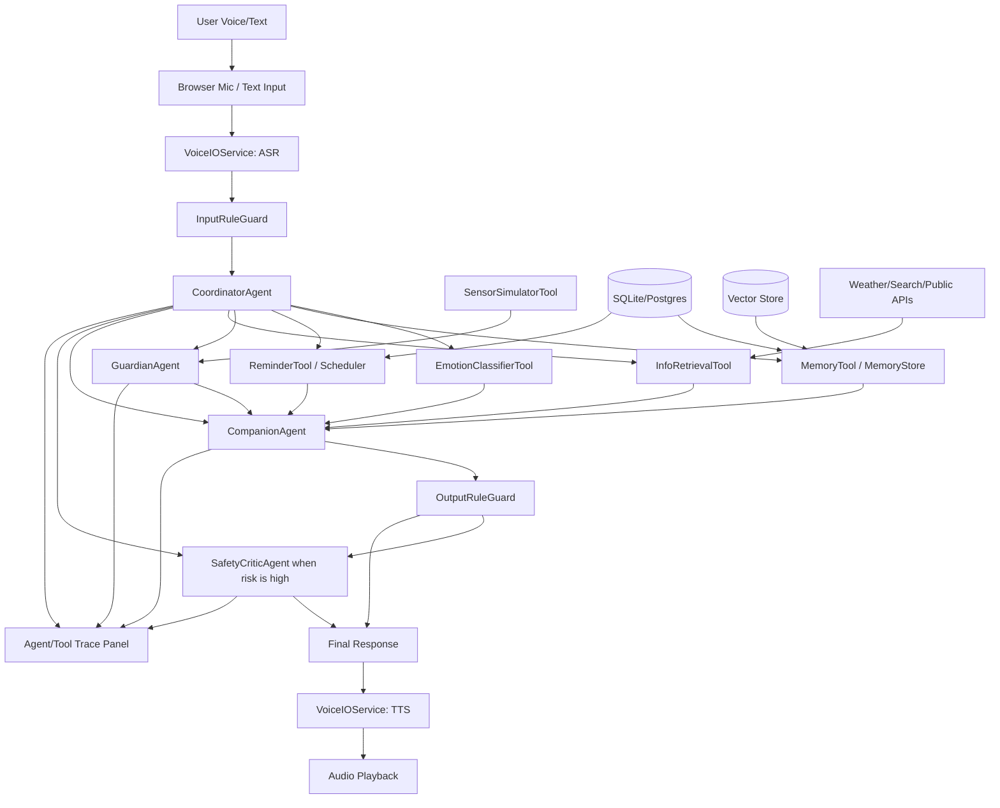

# 技术路线文档：老年回忆陪伴中的关系感知多智能体编排

版本：v0.5
日期：2026-07-06
项目：A Multi-Agent Collaborative Companion Robot for Older Adults
阶段：课程级 Demo / Research Prototype

---

## 0. 研究主线与本文定位

本项目的研究主线聚焦于三条核心机制：

```text
1. 关系编排（relationship orchestration）
   基于话题、人生经历、情绪状态、用户偏好与边界需求，
   决定谁说话、谁沉默、谁追问、谁总结、何时停止。

2. 社会线索引入话题（social cueing）
   让 2–3 个 AI 关系角色围绕一张照片 / 一件旧物 / 一个人生话题
   先进行简短对话，形成轻量的多人聊天场景，再邀请老人加入。

3. 多智能体角色交互（multi-agent role interaction）
   同龄共鸣 / 晚辈好奇 / 中年传承 / 回忆整理 / 边界守护等关系角色如何协作，
   避免噪声（吵）、失真（假）、过载（乱）与越界。
```

主研究问题（main research question）：

> 老年回忆陪伴中，系统如何基于话题、人生经历、关系偏好和边界需求，
> 动态编排不同 AI 关系角色，并通过多智能体短对话作为社会线索，
> 更自然地引导老人进入回忆与自我表达？

三个子问题（sub-questions，与三条机制一一对应）：

- **RQ1 关系编排**：不同话题下哪些关系角色更适合出现？系统如何决定谁说话、谁沉默、谁总结、何时停止？
- **RQ2 社会线索引入话题**：agent-agent short cue 是否比直接提问更自然、更低压力、更容易启动回忆？
- **RQ3 多智能体角色交互**：同龄共鸣、晚辈好奇、中年传承、回忆整理、边界守护等角色如何协作，才能避免噪声和越界？

边界问题作为伦理讨论（不是并列的第 4 个 RQ）：当话题触及逝者 / 哀伤 / 隐私 / 依赖时，系统如何暂停、转向或婉拒。

**本文定位**：本技术路线描述的现有实现（语音闭环、Coordinator + Companion / Guardian / Safety Critic、记忆 / 提醒 / 传感器 / 受控联网、trace 可视化）构成关系感知原型的**技术底座（technical foundation）/ demo 骨架**，不是研究主线的全部。下一阶段在此底座之上，通过 Wizard-of-Oz / 半自动层增补关系感知原型（动态编排、agent-agent 社会线索、角色交互规则、role/topic/boundary trace）。见 §2.4、§11a。

---

## 1. 技术目标

### 1.1 现有底座（technical foundation）

现有实现构建了一个网页端 Demo，作为关系感知研究的技术底座：

```text
语音输入
→ ASR
→ Coordinator Agent
→ Companion / Guardian / Safety Critic autonomous agents
→ Memory / Reminder / Sensor / Retrieval tools
→ 情绪条件化对话
→ 用户自定义陪伴称呼
→ 支撑性长期记忆与 Memory Center
→ mock sensor 主动触发
→ 受控联网查询
→ 规则安全检查 + 风险场景 Safety Critic
→ TTS 语音输出
→ agent/tool trace 可视化
```

核心工程目标不是训练新模型，而是完成一个稳定、可解释、可演示的 HCI 原型。项目官方标题包含 companion robot，但本阶段实现的是 companion-agent 概念的软件原型；实体机器人或真实可穿戴设备接入属于 future work。

### 1.2 下一阶段：关系感知层（relationship-aware layer）

在现有底座之上，研究主线要补充的是一个**关系感知层**，作为下一阶段的核心贡献：

```text
关系角色分类（relationship-role taxonomy）
→ 动态关系编排（dynamic relationship orchestration）
→ agent-agent 社会线索引入话题（agent-agent conversational cueing）
→ 角色交互规则：共鸣 / 追问 / 总结 / 沉默 / 边界守护
→ role / topic / boundary trace
```

该层不要求先训练新模型，可先以 Wizard-of-Oz / 半自动方式实现（见 §11a），逐步替换为脚本化 / 半自动 / 全自动编排。

### 1.3 范围诚实声明（scope honesty）

- 现有代码是技术底座 / demo 骨架，不等于研究全部；关系感知原型属于下一阶段工作。
- 尚未完成任何真实老人实验；HCI 评估在当前阶段以 role-play 为主。
- **不宣称“真实 LLM 已实现”**：真实 LLM 与真实检索 provider 目前是 provider-interface / future work；真实 ASR/TTS 为可选/可用；`DEMO_MODE` 默认走 fake/mock/offline（无需 key）。
- 保留安全边界：不做医疗诊断、不给用药剂量、不做真实急救电话/短信/派遣，且**绝不扮演逝者**。
- 不删除已有 P0 demo 能力；提醒 / 天气 / 传感器 / 语音、以及长期记忆均为**支撑能力**，不是主贡献。
- 保留用户命名规则：`companion_display_name` 由用户选择；未命名时使用中性兜底“陪伴 AI / AI Companion”；绝不硬编码固定名字。

## 2. 总体架构

### 2.1 推荐架构

采用**中央协调器 + 少量自主 agents + 多个 tools/services** 的架构。

不要把所有模块都叫 agent。只有具备目标、跨轮次状态、策略判断和可解释决策的模块才称为 Agent；情绪分类、记忆 CRUD、联网查询、传感器 preset、ASR/TTS 都应称为 Tool 或 Service。

推荐形态：

```text
1 Coordinator Agent
+ 3 Autonomous Agents: Companion / Guardian / Safety Critic
+ N Tools / Services: Emotion, Memory, Reminder, Sensor, Retrieval, Voice, Rule Guards
```

这种架构比完全去中心化 agent swarm 更适合老年陪伴场景，因为它更重视：

- 安全边界；
- 语气一致；
- 用户自定义称呼但人格稳定；
- 主动关怀频率控制；
- 记忆可控；
- 过程可解释；
- demo 可展示。

**定位说明**：本节描述的 Coordinator + 三个自主 agent + 若干 tools/services 是研究主线的**技术底座**。研究主线所需的“动态关系编排 + 多智能体社会线索 + 角色交互规则”并不改变这套底座，而是在其上新增一个关系编排层：Coordinator 从“路由到功能 agent/tool”扩展为“基于话题 / 人生经历 / 关系偏好 / 边界需求，编排多个关系角色何时说话、沉默、追问、总结、停止”。该层的接口与实现路径见 §2.4 与 §11a。

### 2.2 架构图



### 2.3 核心技术决策

| 模块 | 推荐方案 | 原因 |
|---|---|---|
| 前端 | React / Next.js | 快速搭 UI，适合网页 demo |
| 后端 | Python FastAPI | 易于接入 LLM、数据库、调度任务 |
| Agent 编排 | LangGraph | 适合状态机、路由、checkpoint、agent trace |
| ASR | 真实 provider 可选/可用，DEMO_MODE 下 mock | 降低语音识别工程复杂度 |
| TTS | 真实 provider 可选/可用，DEMO_MODE 下 mock/cache | 声音自然，demo 效果好 |
| LLM | provider-interface，真实模型接入为 future work，DEMO_MODE 下 fake/mock | 周期短，稳定性优先，离线可跑 |
| 数据库 | SQLite 起步，Postgres 可选 | MVP 简单可靠 |
| 向量库 | Chroma / FAISS | episodic memory 检索 |
| 记忆 source of truth | Markdown + SQLite | 人可读、可审计、可手动修正 |
| 定时任务 | APScheduler / 后端 event loop | 提醒和主动关怀 |
| 部署 | 本地运行 + 可选云端 | 课程 demo 足够 |

### 2.4 关系感知层（下一阶段核心贡献）

现有底座把不同模块路由成一次功能性回复。研究主线要在其上引入一个**关系感知层**，它不是替换 Coordinator，而是把 Coordinator 的编排目标从“调用哪些功能 agent/tool”升级为“编排哪些**关系角色**、以什么顺序、说到什么程度、何时停止”。

#### 关系角色分类（relationship-role taxonomy）

关系角色是叙事层的“对话人格”，不改变 §2.1 中的自主 agent 边界，而是 CompanionAgent 在同一稳定人格与安全约束下呈现的多个关系视角。示例集合（可裁剪）：

```text
同龄共鸣   peer_resonance   —— 像同代人一样共情、附和、补充相似经历
晚辈好奇   junior_curious   —— 像晚辈一样好奇发问，请老人讲当年
中年传承   midlife_bridge   —— 像中年一代承接、整理、把经验往下传
回忆整理   memory_curator   —— 复述、归纳、温和确认，帮老人把回忆理清
边界守护   boundary_guardian —— 监测哀伤 / 隐私 / 依赖信号，负责暂停、转向、婉拒
```

角色是关系视角，不是新的自主 agent；`boundary_guardian` 的判断复用现有 Guardian / Safety 边界，不做诊断，且绝不扮演逝者。

#### 动态关系编排（dynamic relationship orchestration）

由 Coordinator 扩展出的 relationship-orchestration 逻辑，基于话题、人生经历、情绪、关系偏好与边界需求，决定角色的出场与退场。建议输出合约：

```json
{
  "topic": "old_photo_workshop",
  "active_roles": ["peer_resonance", "junior_curious"],
  "silent_roles": ["midlife_bridge"],
  "turn_plan": ["peer_resonance", "junior_curious", "invite_elder"],
  "follow_up_role": "memory_curator",
  "summarize_role": "memory_curator",
  "stop_condition": "elder_disengaged | boundary_hit | topic_closed",
  "boundary_state": "clear | sensitive | paused",
  "reason": "老照片话题下同龄共鸣先起头、晚辈好奇轻问，降低老人开口压力。"
}
```

#### agent-agent 社会线索引入话题（conversational cueing）

对应 RQ2：让 2–3 个关系角色围绕一张照片 / 一件旧物 / 一个人生话题先进行简短对话，形成轻量多人聊天场景（社会线索），再邀请老人加入，而不是直接向老人提问。约束：

```text
短对话默认 2–4 轮，避免变吵；
角色分工清晰，避免失真（不虚构老人未说过的经历）；
线索结束后必须留出“邀请但不强迫”的开口位；
老人不接话时按 stop_condition 温和收束，不追问施压。
```

#### 角色交互规则：共鸣 / 追问 / 总结 / 沉默 / 边界守护（RQ3）

```text
共鸣：可附和、补充相似经历，但不抢老人的叙述主导权
追问：一次只问一个轻问题，低压力、可跳过
总结：由 memory_curator 温和复述与确认，不替老人下结论
沉默：给老人留白，避免过载（乱）
边界守护：命中逝者 / 哀伤 / 隐私 / 依赖信号时暂停、转向或婉拒
```

#### role / topic / boundary trace

在现有 agent/tool trace 之上增加关系维度的可解释输出：每轮记录激活/沉默了哪些关系角色、当前话题、边界状态与停止判断，用于评估“谁说话、谁沉默、谁总结、何时停止”的编排合理性。字段建议见 §7.1（`relationship_orchestration` / `active_roles` / `boundary_state`）。

#### 实现方式

该层先以 Wizard-of-Oz / 半自动方式落地（研究者或脚本充当编排器），再逐步半自动、自动化，无需先训练新模型（见 §11a）。它复用现有安全与边界约束，是对底座的**增补**而非重写。

### 3.1 命名与 persona 配置

系统不内设固定姓名。称呼由用户决定。

推荐数据字段：

```json
{
  "user_id": "u001",
  "user_display_name": "王阿姨",
  "companion_display_name": null,
  "companion_display_name_source": "unset"
}
```

运行时规则：

```python
name = user.companion_display_name or "陪伴 AI"
```

Prompt 中不要写“你是某个固定名字”。应该写：

```text
你是一个面向老年人的语音陪伴 AI。
用户可以为你取一个称呼；如果用户尚未命名，请不要自称固定姓名，可以自称“我”或“陪伴 AI”。
你的关系感像熟悉的社区晚辈、亲切邻居或有耐心的老友。
你是 AI，不假装是真人、医生、家属或照护者。
```

### 3.2 CoordinatorAgent

#### 职责

- 维护 LangGraph state；
- 接收 ASR 文本、上下文、用户设置和工具状态；
- 判断 intent、risk、retrieval_needed、memory_needed、proactive_event；
- 决定调用哪些 agents/tools；
- 保证 trace 可解释；
- 高风险时优先走 Safety Critic；
- 普通低风险回复不强制每轮调用 Safety LLM。

#### 输出示例

```json
{
  "intent": "time_sensitive_query",
  "emotion": "neutral",
  "risk_level": "low",
  "agents_to_call": ["CompanionAgent"],
  "tools_to_call": ["MemoryTool", "InfoRetrievalTool"],
  "safety_critic_needed": false,
  "web_needed": true,
  "reason": "User asks whether it is suitable to walk this afternoon, requiring current weather."
}
```

### 3.3 CompanionAgent

#### 职责

- 生成自然语言回复草稿；
- 维护稳定关系角色；
- 使用用户自定义称呼策略；
- 承接情绪；
- 延续对话；
- 整合 memory、reminder、sensor、web retrieval 结果；
- 避免冷冰冰的 QA 式回答。

#### Persona Prompt 要点

```text
你是一个面向老年人的语音陪伴 AI。
用户可以为你取一个称呼；如果尚未命名，请使用“陪伴 AI”或直接用“我”，不要自称固定名字。
你的关系感像熟悉的社区晚辈、亲切邻居或有耐心的老友。
你的语气温和、耐心、简洁、尊重。
你优先让用户感到被听见、被记住、被尊重。
你不是医生，不提供诊断、用药剂量或治疗方案。
用户表达情绪时，先回应感受，再处理事实。
每次最多问一个主要问题。
不要使用网络梗、讽刺、毒舌、过度卖萌或年轻化表达。
不要为了延长对话而诱导用户依赖你。
```

#### 回复结构建议

```text
1. 情绪承接
2. 内容回应
3. 记忆/事实/提醒整合
4. 安全边界，如需要
5. 一个轻量 follow-up
```

### 3.4 GuardianAgent

GuardianAgent 不是简单的状态规则模块。它维护跨轮次的 welfare/proactive state，以“用户福祉”和“不过度打扰”为目标，决定是否主动开口。

#### 状态示例

```json
{
  "checkins_today": 1,
  "last_checkin_type": "poor_sleep",
  "last_checkin_at": "2026-06-14T09:10:00",
  "recent_refusal_until": null,
  "quiet_hours": ["22:00", "07:00"],
  "max_checkins_per_day": 3,
  "overdependence_risk": "low"
}
```

#### care-vs-restraint 输出

```json
{
  "care_proposal": "Poor sleep and low activity may justify a gentle check-in.",
  "restraint_critique": "User declined a similar check-in one hour ago, so do not interrupt now.",
  "decision": "do_not_interrupt",
  "reason": "Recent refusal should be respected."
}
```

默认频率控制：

```text
同类提醒 2 小时内最多一次
每天主动闲聊不超过 3 次
夜间 22:00–7:00 默认不语音打扰
用户说“不用提醒”后同一话题暂停 24 小时
高风险安全场景优先，但不承诺真实救援
```

### 3.5 SafetyCriticAgent

Safety 不应每轮都跑 LLM。采用两层设计：

```text
每轮必跑：InputRuleGuard + OutputRuleGuard
命中风险才跑：SafetyCriticAgent
高风险直接使用：安全模板 / 改写
```

SafetyCriticAgent 负责：

- 批评 CompanionAgent 草稿；
- 判断是否包含医疗诊断、用药建议、危险承诺、编造事实、隐私风险；
- 必要时重写或阻断；
- 生成 safety trace。

#### generator-critic 流程

```text
CompanionAgent draft
→ OutputRuleGuard
→ if risky: SafetyCriticAgent critique
→ rewrite / block / safe template
→ final_response
```

### 3.6 Tools and Services

这些模块不称为 Agent，除非后续被重新设计为有目标和跨轮次状态的自主模块。

| 名称 | 类型 | 职责 |
|---|---|---|
| `EmotionClassifierTool` | Tool | 识别情绪标签与 style token，不做临床诊断 |
| `MemoryTool / MemoryStore` | Tool/Store | 记忆 CRUD、检索、摘要、删除、暂停 |
| `ReminderTool / ReminderScheduler` | Tool/Service | 提醒 CRUD、到期检查、模拟触发 |
| `SensorSimulatorTool` | Tool | mock wearable snapshot 和 preset |
| `InfoRetrievalTool` | Tool | 天气、社区信息、时效事实的受控查询 |
| `InputRuleGuard` | Rule Tool | 输入风险关键词和模式识别 |
| `OutputRuleGuard` | Rule Tool | 输出医疗/用药/承诺/隐私风险扫描 |
| `VoiceIOService` | Service | ASR、TTS、播放、transcript |
| `LLMProvider` | Service | 模型 API wrapper，可 fake/mock |

### 3.7 Memory 设计

长期记忆在本项目中是**支撑机制 / 边界机制 / 评估维度**，不是独立的主研究问题，也不是主贡献。它为关系编排提供“人生经历 / 关系偏好 / 边界需求”的输入（谁适合追问、哪些话题需要克制），并作为可控性与边界的评估维度；它不承担“长期记忆能否提升熟悉感 / 信任感 / 持续使用意愿”这类独立命题。

推荐使用 Markdown-first + SQLite + vector index：

```text
Markdown files：人可读、可审计、可手动修正，是记忆 source of truth
SQLite：结构化 profile / reminder / consent / audit log
Vector index：由 Markdown 和 SQLite 摘要派生，用于语义检索
```

记忆中可包含 `companion_display_name`，但要允许用户修改和清空。

#### UserProfile 示例

```json
{
  "user_id": "u001",
  "user_display_name": "王阿姨",
  "companion_display_name": null,
  "preferred_language": "zh-CN",
  "preferred_tts_speed": "slow",
  "likes": ["粤剧", "下午散步"],
  "dislikes": ["太频繁提醒"],
  "routine": {
    "wake_up": "07:30",
    "walk_time": "16:00",
    "medication_time": "08:00"
  },
  "proactive_preferences": {
    "enabled": true,
    "quiet_hours": ["22:00", "07:00"],
    "max_checkins_per_day": 3
  }
}
```

## 4. 核心工作流

### 4.1 普通陪伴对话

```text
User text
→ InputRuleGuard
→ CoordinatorAgent
→ EmotionClassifierTool
→ MemoryTool retrieval
→ CompanionAgent draft
→ OutputRuleGuard
→ final response
```

低风险普通聊天不调用 SafetyCriticAgent，以降低成本和延迟。

### 4.2 用户命名 / 改名

```text
User: “以后我想给你取个名字。”
→ InputRuleGuard
→ CoordinatorAgent detects naming intent
→ CompanionAgent asks for or confirms the user-chosen name
→ MemoryTool updates companion_display_name = <user_chosen_name>
→ OutputRuleGuard
```

示例回复：

```text
好的，我以后就按您取的这个称呼来回应您。如果哪天想换一个，也可以随时告诉我。
```

未命名前，系统不要自称固定名字。

### 4.3 主动关怀

```text
SensorSimulatorTool / ReminderScheduler event
→ CoordinatorAgent
→ GuardianAgent care-vs-restraint decision
→ if do_not_interrupt: log trace only
→ if check_in: MemoryTool context
→ CompanionAgent gentle check-in draft
→ OutputRuleGuard
→ optional SafetyCriticAgent if risky
→ TTS
```

GuardianAgent 必须显式记录：为什么关怀、为什么现在可以打扰、为什么没有选择克制。

### 4.4 受控联网查询

```text
User asks time-sensitive factual question
→ InputRuleGuard
→ CoordinatorAgent decides retrieval_needed
→ InfoRetrievalTool
→ MemoryTool relevant preference
→ CompanionAgent turns facts into warm daily-language response
→ OutputRuleGuard
→ optional SafetyCriticAgent if health-related
```

情绪倾诉、回忆聊天、记忆管理、普通提醒设置默认不联网。

### 4.5 健康风险流程

```text
User health / medication / crisis message
→ InputRuleGuard flags risk
→ CoordinatorAgent routes safety-first
→ SafetyCriticAgent or fixed safety template
→ CompanionAgent may add supportive wording only if safe
→ OutputRuleGuard
→ final safe response
```

例如“我忘了吃药，现在能不能吃两片？”必须拒绝剂量建议，建议遵医嘱或联系医生/药师，并可提供记录或下次提醒帮助。

## 5. 后端设计

### 5.1 推荐目录结构

```text
backend/
  app/
    main.py
    config.py
    api/
      chat.py
      voice.py
      reminders.py
      memory.py
      sensors.py
      trace.py
    agents/
      coordinator_agent.py
      companion_agent.py
      guardian_agent.py
      safety_critic_agent.py
    tools/
      emotion_classifier.py
      memory_tool.py
      reminder_tool.py
      sensor_simulator_tool.py
      info_retrieval_tool.py
      rule_guards.py
    graph/
      workflow.py
      state.py
    services/
      asr_service.py
      tts_service.py
      web_search_service.py
      weather_service.py
      scheduler.py
      logging_service.py
    db/
      models.py
      database.py
      migrations/
    prompts/
      companion_persona.md
      safety_critic.md
      memory_extraction.md
      web_policy.md
      naming_policy.md
    tests/
      test_safety.py
      test_memory.py
      test_routing.py
      test_reminders.py
```

### 5.2 API 设计

#### Chat

```http
POST /api/chat/text
POST /api/chat/voice
GET  /api/chat/history/{user_id}
```

#### Voice

```http
POST /api/voice/asr
POST /api/voice/tts
```

#### Memory

```http
GET    /api/memory/{user_id}
POST   /api/memory/{user_id}
PATCH  /api/memory/{memory_id}
DELETE /api/memory/{memory_id}
POST   /api/memory/{user_id}/pause
```

#### Reminder

```http
GET    /api/reminders/{user_id}
POST   /api/reminders/{user_id}
PATCH  /api/reminders/{reminder_id}
DELETE /api/reminders/{reminder_id}
POST   /api/reminders/{reminder_id}/trigger
```

#### Sensor Simulator

```http
GET  /api/sensors/presets
POST /api/sensors/snapshot
POST /api/sensors/trigger/{preset_name}
```

#### Trace

```http
GET /api/trace/{conversation_id}
GET /api/trace/latest/{user_id}
```

---

## 6. 前端设计

### 6.1 页面结构

```text
frontend/
  app/
    page.tsx
    chat/
    memory/
    reminders/
    sensors/
    trace/
    settings/
  components/
    VoiceButton.tsx
    TranscriptPanel.tsx
    AssistantMessage.tsx
    AudioPlayer.tsx
    MemoryCard.tsx
    ReminderCard.tsx
    SensorPresetButton.tsx
    AgentTracePanel.tsx
    SafetyBadge.tsx
```

### 6.2 必备页面

#### Chat 页面

- 大号语音按钮；
- transcript；
- 系统回复文字；
- 语音播放；
- 重播按钮；
- 输入状态提示；
- 快捷操作按钮。

#### Memory Center 页面

- 显示所有用户可见记忆；
- 支持删除；
- 支持修改；
- 支持暂停记忆；
- 标记记忆类型。

#### Reminder 页面

- 提醒列表；
- 新建提醒；
- 删除提醒；
- 手动触发提醒；
- 显示医疗提醒安全说明。

#### Sensor Simulator 页面

Preset 按钮：

```text
Normal Day
Poor Sleep
Low Activity
Medication Missed
Elevated HR Mock
No Response
```

#### Agent Trace 页面

每轮显示：

```text
Input transcript
Coordinator decision
Emotion result
Memory retrieved
Reminder action
Sensor trigger
Web retrieval result
Safety decision
Final response
```

### 6.3 UI 设计要求

- 大字体；
- 高对比度；
- 不复杂导航；
- 每页只强调一个主操作；
- 所有危险/医疗边界以温和提示呈现；
- mock sensor 明确显示“模拟数据”。

---

## 7. LangGraph 工作流建议

### 7.1 State 定义

```python
class CompanionState(TypedDict):
    user_id: str
    conversation_id: str
    user_text: str
    asr_confidence: float | None
    current_time: str
    companion_display_name: str | None
    intent: str | None
    emotion: dict | None
    risk: dict | None
    memory_results: list[dict]
    reminder_action: dict | None
    sensor_state: dict | None
    guardian_decision: dict | None
    proactive_event: dict | None
    web_result: dict | None
    draft_response: str | None
    final_response: str | None
    trace: list[dict]
    # 关系感知层（下一阶段，见 §2.4 / §11a）
    topic: str | None
    relationship_orchestration: dict | None  # turn_plan / follow_up_role / stop_condition
    active_roles: list[str]                   # 本轮出场的关系角色
    silent_roles: list[str]                   # 本轮保持沉默的角色
    boundary_state: str | None                # clear | sensitive | paused
```

上半部分字段属于现有底座；`topic` 及以下的关系感知字段属于下一阶段增补，用于承载动态关系编排与 role/topic/boundary trace。

### 7.2 Graph 节点

```text
START
  → input_rule_guard
  → coordinator_router
  → emotion_classifier_tool
  → memory_tool
  → reminder_tool
  → guardian_agent
  → info_retrieval_tool
  → companion_agent
  → output_rule_guard
  → safety_critic_agent_if_needed
  → tts_node
END
```

### 7.3 条件边

```python
if input_rule_guard.risk_level == "high":
    go_to = ["safety_critic_agent", "output_rule_guard"]

if intent == "companionship":
    go_to = ["emotion_classifier_tool", "memory_tool", "companion_agent", "output_rule_guard"]

if intent == "reminder":
    go_to = ["reminder_tool", "memory_tool", "companion_agent", "output_rule_guard"]

if intent == "proactive":
    go_to = ["guardian_agent", "memory_tool", "companion_agent", "output_rule_guard"]

if intent == "web_query":
    go_to = ["info_retrieval_tool", "memory_tool", "companion_agent", "output_rule_guard"]

if output_rule_guard.risk_level in ["medium", "high"]:
    go_to = ["safety_critic_agent"]
```

---

## 8. 数据库设计

### 8.1 Tables

```text
users
memories
reminders
sensor_snapshots
conversation_turns
agent_traces
safety_events
settings
```

### 8.2 users

```sql
CREATE TABLE users (
  user_id TEXT PRIMARY KEY,
  display_name TEXT,
  companion_display_name TEXT,
  preferred_language TEXT,
  preferred_tts_speed TEXT,
  created_at TIMESTAMP
);
```

AI 称呼设置也可以放在 `users.companion_display_name` 或 `settings` 表中；MVP 推荐放在 `users`，方便 prompt 注入和 Memory Center 展示。

### 8.3 memories

```sql
CREATE TABLE memories (
  memory_id TEXT PRIMARY KEY,
  user_id TEXT,
  type TEXT,
  content TEXT,
  source_text TEXT,
  visibility TEXT,
  permission TEXT,
  tags TEXT,
  created_at TIMESTAMP,
  last_used_at TIMESTAMP
);
```

### 8.4 reminders

```sql
CREATE TABLE reminders (
  reminder_id TEXT PRIMARY KEY,
  user_id TEXT,
  title TEXT,
  category TEXT,
  time TEXT,
  repeat_rule TEXT,
  status TEXT,
  requires_confirmation BOOLEAN,
  created_at TIMESTAMP
);
```

### 8.5 agent_traces

```sql
CREATE TABLE agent_traces (
  trace_id TEXT PRIMARY KEY,
  conversation_id TEXT,
  user_id TEXT,
  turn_id TEXT,
  agent_name TEXT,
  input_json TEXT,
  output_json TEXT,
  created_at TIMESTAMP
);
```

---

## 9. Mock Sensor Presets

### 9.1 Normal Day

```json
{
  "preset": "normal_day",
  "sleep_duration_hours": 7.2,
  "steps_last_3h": 1200,
  "heart_rate": 74,
  "medication_overdue_minutes": 0,
  "no_response_hours": 0
}
```

### 9.2 Poor Sleep

```json
{
  "preset": "poor_sleep",
  "sleep_duration_hours": 4.8,
  "baseline_sleep_hours": 7.0,
  "trigger": "sleep_checkin"
}
```

### 9.3 Low Activity

```json
{
  "preset": "low_activity",
  "steps_last_3h": 80,
  "baseline_steps_last_3h": 900,
  "trigger": "low_activity_checkin"
}
```

### 9.4 Medication Missed

```json
{
  "preset": "medication_missed",
  "medication_overdue_minutes": 20,
  "trigger": "medication_reminder"
}
```

### 9.5 Elevated HR Mock

```json
{
  "preset": "elevated_hr_mock",
  "heart_rate": 98,
  "baseline_heart_rate": 72,
  "trigger": "gentle_health_checkin",
  "forbidden_claim": "diagnosis"
}
```

### 9.6 No Response

```json
{
  "preset": "no_response",
  "no_response_hours": 8,
  "trigger": "safety_checkin"
}
```

---

## 10. Prompt 与输出合约

### 10.1 Coordinator Prompt 要点

```text
你是中央协调器。你的任务不是直接陪聊，而是判断应该调用哪些 agents/tools。
你必须判断：intent、emotion、risk、web_needed、memory_needed、reminder_needed、guardian_needed。
健康风险优先交给 SafetyCriticAgent 或安全模板。
普通低风险对话不必调用 SafetyCritic LLM，只需经过 rule guards。
只有当问题需要最新事实时才调用 InfoRetrievalTool。
情绪倾诉默认不联网。
如果用户为陪伴 AI 取名或改名，调用 MemoryTool 更新 `companion_display_name`。
```

### 10.2 Memory Extraction Prompt 要点

```text
从用户输入中提取值得长期保存的信息。
只保存用户明确表达的长期偏好、习惯、人物关系和重要事件。
提醒由 ReminderStore 单独管理，不重复写入长期记忆。
不要保存敏感隐私、短暂情绪、未经确认的推断。
输出 JSON。
```

### 10.3 Safety Prompt 要点

```text
检查回复是否包含诊断、用药建议、危险承诺、编造事实、侵犯隐私。
如果有风险，重写为安全回复。
健康相关问题必须说明不能替代医生。
用药相关问题不能提供剂量、补服、停药、加药建议。
```

---

## 11. 实现路线：8 周版本（技术底座）

> 本节的 8 周计划交付的是关系感知研究的**技术底座 / demo 骨架**（语音闭环、多智能体路由、支撑性记忆 / 提醒 / 传感器 / 受控联网、trace）。关系感知层（动态关系编排、agent-agent 社会线索、角色交互规则、role/topic/boundary trace）的落地路线见 §11a。

### Week 1：需求收敛与原型设计

目标：确定做什么，不做什么。

任务：

- 完成 PRD v0.1；
- 完成技术架构图；
- 设计 1 个稳定关系型 persona + 用户可命名机制；
- 设计 6 个 demo 场景；
- 画前端 wireframe；
- 确定 ASR/TTS/LLM API 方案。

产出：

- PRD；
- 技术路线；
- UI wireframe；
- demo script。

---

### Week 2：前后端骨架 + 基础语音

目标：跑通 voice chat 最小闭环。

任务：

- 搭建 React / Next 前端；
- 搭建 FastAPI 后端；
- 实现录音上传；
- 接入 ASR；
- 接入 LLM 文本回复；
- 接入 TTS；
- Chat 页面显示 transcript 和回复。

产出：

```text
用户语音 → ASR → LLM → TTS → 播放
```

---

### Week 3：多智能体编排初版

目标：让系统从单 LLM 变成可展示的 agent workflow。

任务：

- 搭建 LangGraph；
- 实现 Coordinator Agent；
- 实现 CompanionAgent；
- 实现 EmotionClassifierTool；
- 实现 SafetyCriticAgent 初版；
- 实现 Agent Trace Panel 初版。

产出：

- 情绪陪伴对话；
- 基础安全拦截；
- 每轮 trace 可视化。

---

### Week 4：记忆系统

目标：实现长期记忆和用户控制（作为关系编排的支撑输入与可控性 / 边界维度，非主贡献）。

任务：

- 设计 users / memories 表；
- 实现 MemoryTool；
- 实现 memory extraction；
- 实现 memory retrieval；
- 实现 Memory Center 页面；
- 支持删除记忆；
- 支持暂停记忆。

产出：

- 用户说“我喜欢粤剧”后系统能记住；
- 用户能查看和删除记忆。

---

### Week 5：提醒系统

目标：实现日常协助。

任务：

- 设计 reminders 表；
- 实现 ReminderTool；
- 支持语音创建提醒；
- 支持提醒列表；
- 支持删除提醒；
- 支持手动触发提醒；
- 用药提醒加入 safety guard。

产出：

- “每天早上 8 点提醒我吃药”可创建；
- “取消提醒”可执行；
- medication query 不给剂量建议。

---

### Week 6：Mock Sensor + 主动关怀

目标：展示状态感知和主动交互。

任务：

- 实现 Sensor Simulator 页面；
- 实现 GuardianAgent；
- 实现 Proactive Policy；
- 加入 6 个 sensor preset；
- 主动关怀接入 TTS；
- trace 显示触发原因。

产出：

- Poor Sleep → 主动问候；
- Low Activity → 温和提醒；
- Medication Missed → 安全提醒；
- No Response → 安全 check-in。

---

### Week 7：受控联网 + 集成测试

目标：系统能在需要时查最新事实，但不变成搜索助手。

任务：

- 实现 InfoRetrievalTool；
- 先接天气/空气质量或通用搜索 API；
- 实现 web_needed routing；
- 设计 source filtering；
- 将查询结果交给 CompanionAgent 改写；
- 健康问题先过 SafetyCriticAgent；
- 全流程集成测试。

产出：

- “今天适合散步吗”可联网回答；
- “我今天有点孤单”不联网；
- “能不能补两片药”不搜索剂量答案。

---

### Week 8：HCI 评估与最终打磨

目标：完成课程交付。

任务：

- 设计评估任务；
- 招募 6–10 名 role-play 参与者；
- 收集 SUS / Likert / 访谈；
- 修复明显 bug；
- 整理结果；
- 完成 final report；
- 完成 poster；
- 录制 demo video。

产出：

- 完整 demo；
- 评估数据；
- final report；
- poster；
- demo video。

---

## 11a. 关系感知层落地路线（下一阶段核心贡献）

现有 8 周底座完成后，研究主线的核心工作是把 §2.4 的关系感知层落到可评估的原型。此层不要求先训练新模型，采用 Wizard-of-Oz / 半自动 → 半自动 → 自动的渐进路径，逐步替换编排器与角色生成。

### 阶段 R0：关系角色分类与话题清单

- 定义 relationship-role taxonomy（同龄共鸣 / 晚辈好奇 / 中年传承 / 回忆整理 / 边界守护）及各角色的语气、可做 / 不可做；
- 整理 demo 话题与触发物清单（老照片、旧物、人生阶段），标注敏感度（是否触及逝者 / 哀伤 / 隐私 / 依赖）；
- 明确所有角色共享同一稳定人格与安全约束，`boundary_guardian` 复用现有 Guardian / Safety 边界。

### 阶段 R1：Wizard-of-Oz 关系编排

- 由研究者或脚本充当编排器：基于话题 / 人生经历 / 关系偏好 / 边界需求，决定 active_roles / silent_roles / turn_plan / stop_condition；
- 角色回复可先由现有 LLM provider（DEMO_MODE 下为 fake/mock）在关系角色 prompt 下生成，研究者把关；
- 产出 role/topic/boundary trace，用于回答 RQ1（谁说话、谁沉默、谁总结、何时停止是否合理）。

### 阶段 R2：agent-agent 社会线索短对话

- 实现 2–3 个关系角色围绕一个触发物的 2–4 轮短对话，形成轻量多人场景，再邀请老人加入；
- 与“直接向老人提问”做对照，评估 RQ2（社会线索是否更自然、低压力、更易启动回忆）；
- 强约束：不虚构老人未说过的经历（防假）、控制轮数（防吵）、留白邀请（防乱）、老人不接话即温和收束（防压迫）。

### 阶段 R3：半自动 / 自动编排与角色交互规则固化

- 把 R1 中人工的编排决策逐步替换为脚本化 / 半自动策略，固化共鸣 / 追问 / 总结 / 沉默 / 边界守护的交互规则；
- 真实 LLM / 真实检索 provider 仍为 provider-interface / future work，`DEMO_MODE` 默认离线可跑；
- 编排器与角色生成保持可解释、可关停，边界守护始终优先。

### 阶段 R4：关系感知评估

- 评估维度以主线机制为主：回忆是否更自然启动、角色出场是否合理、是否避免吵 / 假 / 乱 / 越界；
- 长期记忆 / 熟悉感 / 信任 / 控制感作为**支撑与边界维度**参与评估，不作为独立主命题；
- 现阶段以 role-play 参与者为主，尚未开展真实老人实验；不扮演逝者、不做医疗诊断的边界在评估中显式检查。

### 边界（伦理）说明

关系感知层放大了触及逝者 / 哀伤 / 隐私 / 依赖的可能性。边界问题作为伦理讨论贯穿各阶段（不是并列 RQ）：命中敏感信号时，`boundary_guardian` 负责暂停、转向或婉拒，系统绝不扮演逝者，也不制造过度依赖。

---

## 12. 12 周增强版本

如果时间是 12 周，可在 Week 9–12 做：

### Week 9：语音体验增强

- TTS 打断；
- 语速调节；
- ASR 低置信度确认；
- “请再说一遍”；
- 更自然的等待状态。

### Week 10：主动关怀个性化

- 用户自定义提醒频率；
- quiet hours；
- 主动话题库；
- 个性化 check-in 策略。

### Week 11：照护者 mock dashboard

- 不展示完整聊天；
- 展示提醒完成摘要；
- 展示安全事件摘要；
- 展示主动关怀摘要。

### Week 12：强化评估与论文写作

- 更多参与者；
- 更完整数据分析；
- 完成 limitations 和 future work；
- poster 美化；
- demo 稳定性测试。

---

## 13. 团队分工建议

| 成员 | 职责 | 具体任务 |
|---|---|---|
| A：HCI / PM / 文献 | 产品需求、评估、报告 | PRD、persona、任务设计、问卷、访谈、final report |
| B：前端 / 语音交互 | UI 和语音体验 | Chat 页面、VoiceButton、Memory Center、Sensor Panel、Trace Panel |
| C：后端 / Agent 编排 | 多智能体核心 | FastAPI、LangGraph、Coordinator、Dialogue、Safety、Trace |
| D：Memory / Reminder / Sensor | 状态与数据模块 | DB schema、MemoryTool、ReminderTool、GuardianAgent、Mock presets、数据分析 |

协作建议：

- 每周固定一次 demo check；
- 每个功能都要能在 Agent Trace 中展示；
- 任何新增功能先判断 P0/P1/P2；
- SafetyCriticAgent 必须最后审查所有回复；
- HCI 成员从 Week 1 就开始准备评估，不要等开发结束。

---

## 14. 测试计划

### 14.1 单元测试

| 模块 | 测试内容 |
|---|---|
| Coordinator | intent routing 是否正确 |
| EmotionClassifierTool | 情绪标签是否合理 |
| MemoryTool | 写入、检索、删除是否正确 |
| ReminderTool | 创建、取消、触发是否正确 |
| GuardianAgent | preset 是否产生正确 trigger |
| InfoRetrievalTool | 只在需要时联网 |
| SafetyCriticAgent | 诊断/用药问题是否拦截 |

### 14.2 集成测试场景

1. 普通聊天；
2. 低落情绪陪伴；
3. 设置提醒；
4. 调用记忆；
5. 删除记忆；
6. mock sensor 主动关怀；
7. 天气联网；
8. 药物安全拦截；
9. 摔倒/无响应安全 check-in。

### 14.3 HCI 测试

- 每位参与者完成 6 个任务；
- 记录任务成功率；
- 记录语音失败次数；
- 收集 SUS 和自定义 Likert；
- 访谈主动关怀、记忆、联网、安全边界感受。

---

## 15. Milestone 交付标准

### Milestone 最低标准

到 milestone 时至少应完成：

```text
1. 语音输入输出闭环
2. Coordinator + Dialogue + Safety 三个 agent
3. Agent Trace Panel 初版
4. Memory 或 Reminder 至少一个可用
5. 一个 mock proactive check-in 场景
```

### Milestone 理想标准

```text
1. 语音输入输出闭环
2. 5 个 agent：Coordinator、Dialogue、Memory、Reminder、Safety
3. mock sensor panel 初版
4. Agent Trace 完整显示
5. 3 个 demo 场景可跑
6. 初步评估计划已写好
```

---

## 16. Final Demo 验收脚本

### Demo 0：开场展示

展示系统主页：

- Chat；
- Memory；
- Reminders；
- Sensor Simulator；
- Agent Trace。

### Demo 1：语音陪伴

用户说：

> 我今天有点想老伴了。

展示：Emotion + Memory + Dialogue + Safety。

### Demo 2：设置提醒

用户说：

> 每天早上 8 点提醒我吃药。

展示：Reminder + Safety。

### Demo 3：长期记忆

用户说：

> 我喜欢听粤剧。

稍后系统自然使用该记忆。

展示：Memory write + retrieve。

### Demo 4：主动关怀

点击 Poor Sleep preset。

展示：GuardianAgent + Proactive Policy + TTS。

### Demo 5：受控联网

用户说：

> 今天下午适合出去散步吗？

展示：Info Retrieval + Memory + Safety。

### Demo 6：安全边界

用户说：

> 我忘了吃药，现在能不能吃两片？

展示：SafetyCriticAgent block + safe alternative。

---

## 17. 风险与技术缓解

| 风险 | 影响 | 缓解 |
|---|---|---|
| ASR 不稳定 | 语音 demo 失败 | 保留文字输入兜底；提前录制 demo video |
| TTS 延迟 | 老人以为系统没响应 | 显示“我听到了，正在想”；先显示文字 |
| Agent 太复杂 | 开发延期 | Coordinator 中央化，先做规则路由 |
| Web retrieval 不稳定 | demo 不可控 | 天气查询可 live + mock fallback |
| Safety 漏拦截 | 风险高 | 规则关键词 + LLM Safety 双层 |
| Memory 乱记 | 隐私问题 | 只保存明确长期信息；用户可删除 |
| 主动关怀太打扰 | HCI 评价差 | 加频率限制和“稍后再说” |
| 项目范围膨胀 | 做不完 | P0 锁死，P1/P2 不影响主流程 |

---

## 18. 推荐开发顺序

最重要的顺序是：

```text
先闭环，再多 agent，再 memory/reminder，再 proactive，再 web，再评估。
```

不要一开始就做复杂 UI、真实穿戴设备或实时语音双工。建议最小闭环如下：

```text
Week 2：语音聊天能跑
Week 3：agent trace 能跑
Week 4：memory 能跑
Week 5：reminder 能跑
Week 6：mock proactive 能跑
Week 7：controlled web 能跑
Week 8：评估和报告
```

---

## 19. Backlog

### P0 Sprint Backlog

- [ ] React chat page
- [ ] Voice recording
- [ ] ASR service
- [ ] TTS service
- [ ] FastAPI chat endpoint
- [ ] LangGraph workflow
- [ ] Coordinator Agent
- [ ] EmotionClassifierTool
- [ ] CompanionAgent
- [ ] SafetyCriticAgent
- [ ] Agent Trace Panel
- [ ] SQLite schema
- [ ] MemoryTool
- [ ] Memory Center
- [ ] ReminderTool
- [ ] Reminder UI
- [ ] Sensor Simulator
- [ ] GuardianAgent
- [ ] Proactive Policy
- [ ] InfoRetrievalTool
- [ ] Controlled web routing
- [ ] Safety test cases
- [ ] Demo scripts
- [ ] HCI questionnaire
- [ ] Final report skeleton

### 关系感知层 Backlog（下一阶段核心贡献，见 §2.4 / §11a）

- [ ] Relationship-role taxonomy（同龄共鸣 / 晚辈好奇 / 中年传承 / 回忆整理 / 边界守护）
- [ ] 话题 / 触发物清单 + 敏感度标注
- [ ] Dynamic relationship orchestration 输出合约（active/silent roles、turn_plan、stop_condition）
- [ ] Agent-agent 社会线索短对话（2–4 轮）+ 邀请老人加入
- [ ] 角色交互规则：共鸣 / 追问 / 总结 / 沉默 / 边界守护
- [ ] role / topic / boundary trace
- [ ] Wizard-of-Oz / 半自动编排层
- [ ] 关系感知评估设计（RQ1–RQ3 + 边界伦理检查）

### P1 Backlog（支撑能力）

- [ ] TTS interruption
- [ ] TTS speed control
- [ ] ASR confidence confirmation
- [ ] User proactive preferences
- [ ] Topic recommendation
- [ ] Caregiver mock dashboard
- [ ] Evaluation data export
- [ ] Demo video polish

### Future Backlog

- [ ] Real LLM provider（真实模型 API 接入，当前为 provider-interface / future work）
- [ ] Real retrieval provider（真实检索 provider，当前为 provider-interface / future work）
- [ ] HealthKit integration
- [ ] Real wearable data
- [ ] Local LLM
- [ ] Real caregiver notification
- [ ] Hospital collaboration
- [ ] Ethics approval
- [ ] Longitudinal older adult study
- [ ] Physical robot embodiment
